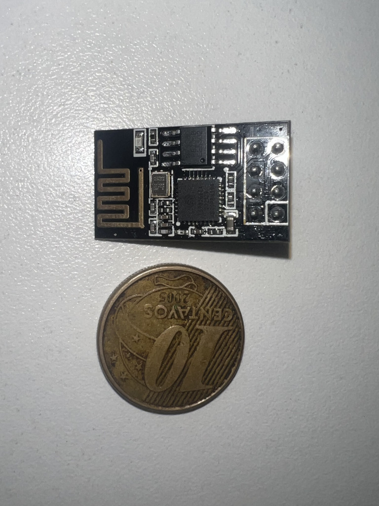
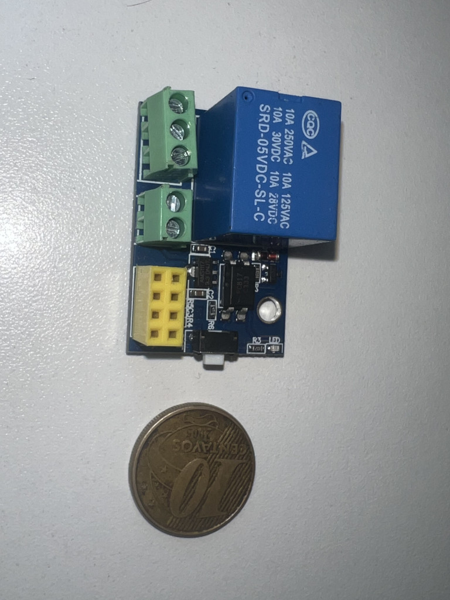
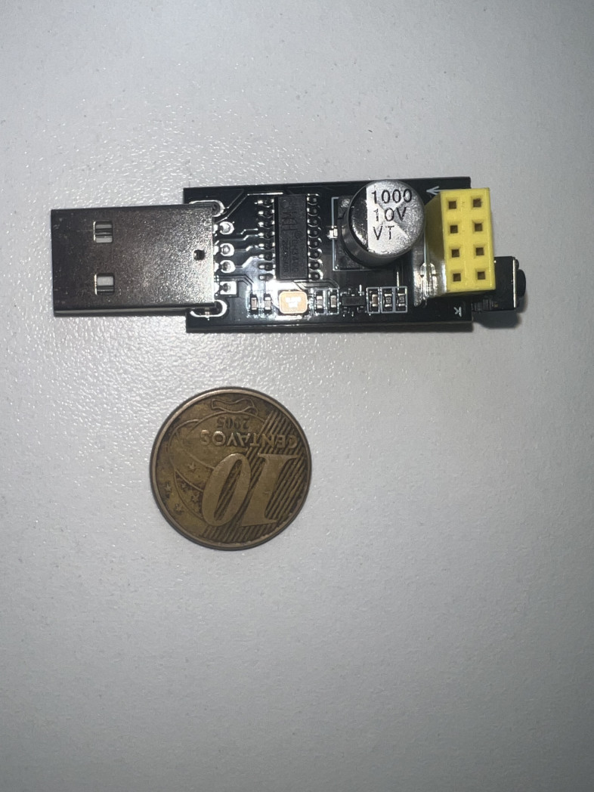

# blinky

An ESP-01S that blinks a lamp. It runs its own WiFi hotspot — join it from a
phone and change the behavior in the browser.

By default the lamp blinks every 5 seconds. The remote UI can switch between
**blink**, **on**, and **off**, and tune the blink period. Settings survive
power cuts.

## Hardware

| Part | Photo | Role |
| --- | --- | --- |
| ESP-01S (ESP8266, 1MB flash) |  | Runs the firmware |
| ESP-01 relay carrier (Songle SRD-05VDC, 10A 250VAC) |  | Switches the lamp; relay on GPIO0; 5V supply |
| CH340 USB serial adapter |  | First (wired) flash only |

> **Why a 5s default?** Each blink is one mechanical relay cycle (~100k–1M
> cycle lifespan) and one audible click. At 5s the relay lasts months even
> blinking 24/7; at 500ms it would die within weeks.

## Quickstart

Requires [mise](https://mise.jdx.dev). It pins python, creates a `.venv`, and
installs PlatformIO from `requirements.txt`.

```sh
mise run setup     # creates .env from .env.example, installs PlatformIO
$EDITOR .env       # set real AP/OTA passwords (AP password >= 8 chars)
```

First flash (wired — ESP-01S socketed in the CH340 adapter):

```sh
mise run upload
mise run monitor   # 115200 baud
```

Then socket the chip into the relay carrier and power it at 5V. Every later
flash can go over the air (join the blinky AP first):

```sh
mise run ota
```

## Usage

1. Join the `blinky` WiFi network (password from your `.env`).
2. Open <http://192.168.4.1>.
3. Pick a mode, tune the period.

### HTTP API

| Endpoint | Method | Params | Returns |
| --- | --- | --- | --- |
| `/` | GET | — | Control UI |
| `/status` | GET | — | `{"mode":"blink","period":5000,"output":false}` |
| `/mode` | POST | `mode=blink\|on\|off` | Updated status |
| `/period` | POST | `period=<ms>` (clamped 200–3600000) | Updated status |

## Development

```sh
mise run test      # host-native unit tests for the blink state machine
mise run build     # compile firmware for esp01_1m
mise run hexdump   # regenerate C headers from web assets in assets/
```

The web UI lives in `assets/index.html`. The `hexdump` task (a dependency of
every build) converts it into a gitignored `PROGMEM` byte-array header that
the firmware serves.

CI builds and tests every push to `main`, then publishes the firmware binary
as a `build-<sha>` release.
